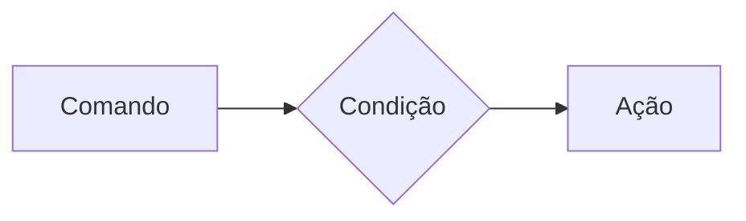
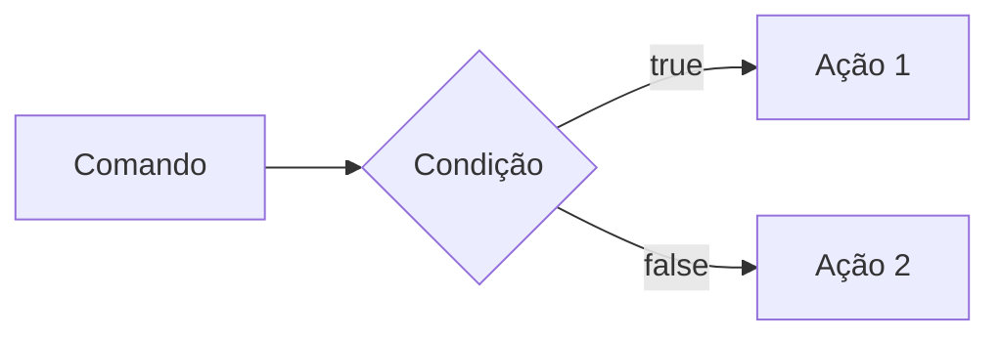
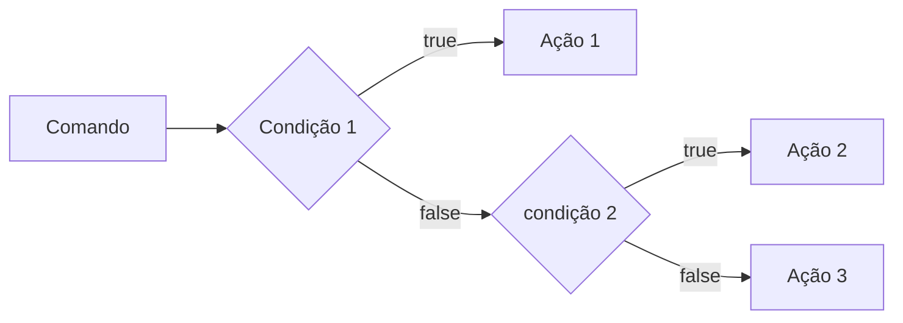
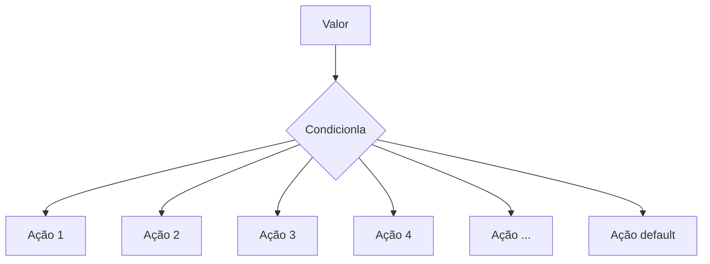

# Estrutura de controle de Dados (Condicionais e repetição)

- **Conteúdo**: Estrutura `if`, `else`, `elseif`, operadores ternários, `match` => substituto do `switch/case`, loops `for`, `while`, `do-while` e `foreach`

#### Estruturas de Controle da Dados Ajudam no Processo de Automatização em Programas e Sistemas

##### Condicionais (IF, ELSE, ELSEIF)

**Formas de Uso**

- uso do `if` apenas:
Exemplo: aplicar desconto de 10% em compras acima de 100 Reais;



```php

if($valorCompra > 100){
    $valorFinal = $valorCompra * 0.9;
}

```

- Us do `if` e do `else`
Exemplo: Aplicar um desconto de 10% para compras acima de 100reais e 5% para as demais compras

```php
if ($valorCompra >100){
    $valorFinal = $valorCompra * 0.9;
} else {
    $valorFinal = $valorCompra * 0.95;
}
```


---

# O uso do `elseif`

-  **elseif** (if Encadeado) => estrutura usada para manipulaçao de dados em duas ou mais condicionais.
**Exemplo:** Compras acima de 200 reais tem 15% de desconto, compras acima de 100 reais tem 10% de desconto e demais compras tem 5% desconto



Exemplo em codigo:

```php
if($valorCompra >200){
    $valorFinal = $valorCompra * 0.85;
} elseif ($valorCompra > 100) {
    $valorFInal = $valorCompra * 0.9;
} else {
    $valorFial = $valorCompra * 0.95;
}

```

>obs: sempre usar `elseif` ára situações que precisam de mais de uma condição, ou seja, fazer encadeamento das condições

- Uso *ERRADO* do if 

```php
if($valorCompra > 200) {
    $valorFinal = $valorCompra *0.85;
}
if ($valorCompra >100){
    $valorFinal = $valorCopra *0.9;
}else {
    $valorFInal = $valorCompra *0.95;
}

```

---

## Operadores Ternários
Um atalho a estrutura condicioal `if/else`, nromalmente escrito em uma unica linha de codigo.

`codição ? verdadeira : falsa `
Perfeito para decisões curtas de uma linha de comando

? => informação verdadeira.
: => iformação falsa.

Exemplo: Verificar se a pessoa é maior de idade (18);

```php
$idade = 20;
//O formato é (condição) ? Verdadeiro : false;

$status = ($idade >=18) ? " Maior de Idade" : "menor de idade";
$status2 = ($iade>=60) ? "idoso" : ($idade>=18) ? "adulto" : "criança";

echo $status 

```

### expressão Condicional `match` (PHP 8)

No mercado atual de PHP, não se usa mais uma `Switch/Case` para cehagr valores fixos, usa-se o `match`. Ele Compara um valor e retorna diretamente o resulato caso atenda a condição.



EXEMPLO: Selecionar o dia da semana apartir de um Nº

```php

$diaSemanaNum = date("W"); // pega o dia da semana em formato numerico
$nomeDiaSemana = match($diaSemanaNum) {
    "0" => "Domingo";
    "1" => "Segunda";
    "2" => "Terça";
    "3" => "Quarta";
    "4" => "Quinta";
    "5" => "Sexta";
    "6" => "Sabado";
    "default" => "Dia invalido"
};

echo "Hoje é : $nomeDiaSemana";

``` 


