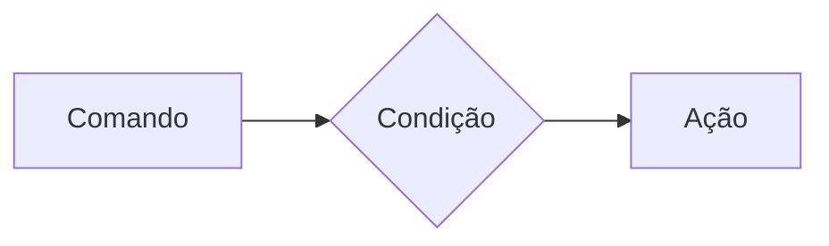
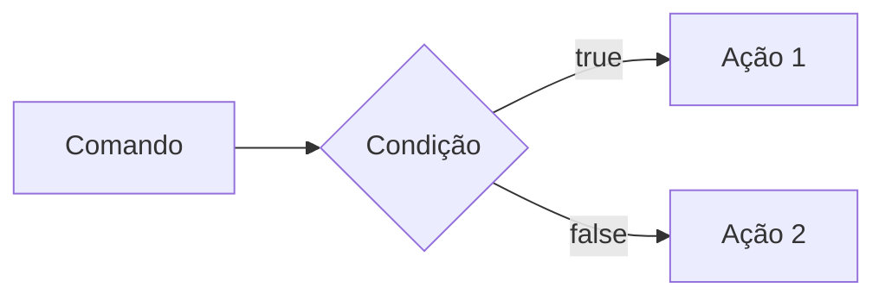

# Estrutura de controle de Dados (Condicionais e repetição)

- **Conteúdo**: Estrutura `if`, `else`, `elseif`, operadores ternários, `match` => substituto do `switch/case`, loops `for`, `while`, `do-while` e `foreach`

#### Estruturas de Controle da Dados Ajudam no Processo de Automatização em Programas e Sistemas

##### Condicionais (IF, ELSE, ELSEIF)

**Formas de Uso**

- uso do `if` apenas:
Exemplo: aplicar desconto de 10% em compras acima de 100 Reais;



```php

if($valorCompra > 100){
    $valorFinal = $valorCompra * 0.9;
}

```

- Us do `if` e do `else`
Exemplo: Aplicar um desconto de 10% para compras acima de 100reais e 5% para as demais compras

```php
if ($valorCompra >100){
    $valorFinal = $valorCompra * 0.9;
} else {
    $valorFinal = $valorCompra * 0.95;
}
```

