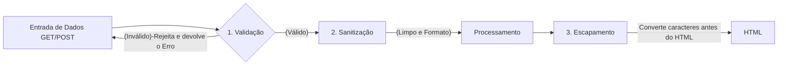

# Semana 7 Segurança no BackEnd - Sanitização, Validação e Proteção contra XSS

### 1º primeiro mandamento do Dev BackEnd - 

> Nunca Confie no Usuário: Toda entrada de dados vindo de fora do servidor é portencialmente maliciosa até que seja **rigorosamente validada, sanitizada e codificada**

Quando tu disponibiliza o campo de texto em um site, qualquer pessoa conectada a internet pode digitar códigos maliciosos em vez de texto. Se o código BackEnd pega esse texto diretamente sem nenhum tratamento, a ordem de execução de códigos abrirá porta para a invasão devastadoras do seu sistema.


### A anatomia de um Ataque: Oque é Cross-Site cripting (XSS)

O XSS ocorre quando uma aplicação web inclui dados não confiaveis em uma pagina web sem a devida validação ou escape de caracteres. Isso permite que um atacante execute scripts maliciosos(geralmente em JavaScript) diretamente no navegador de outro Usuario que visitam o site.

**Como o ataque acontece:**

1. *Roubo de sessão(Cookie stealing)*: O JavaScript injetado le os cookies de autenticação da vitima (documente.cookie) e os envia para o servidor do atacante, permitindo qe ele faça loguin na conta ta vitima sem precisar de senha.

2. *Desconfiguração do Site(Defacement)*: Alterar visualmente o site, inserindo mensagens falsas, banners ofensivos ou formularios de login fraudulentos (phising interno).

3. *Redirecionamento Malicioso*: Força o navegador da víima a abrir sites com vírus ou páginas clonadas de banco.

4. *Captura de Teclas(KeyLoger)*: Grava tudo o que a vitima digita enquanto a página estiver aberta.

---

**Os Vetores de Ataques Mais Frequentes:**


Nem todo ataque XSS usa a tag óbvia `<script>`. Desenvolvedores que tentam bloquear XSS apenas "apagando a palavra script" são facilmente burlados por atacantes:

| Vetor de Injeção | Como funciona o ataque? |
| :--- | :--- |
| `<script>alert('XSS')</script>` | Injeção direta de bloco de script executável pelo navegador. |
| `` | O navegador tenta carregar a imagem inexistente e dispara o evento `onerror` com o JavaScript. |
| `<svg onload="alert('XSS')">` | O navegador renderiza o elemento gráfico SVG e executa o evento `onload`. |
| `<a href="javascript:alert('XSS')">Clique</a>` | O clique no link executa a pseudo-URL com JavaScript em vez de abrir um site. |
| `"><script>alert('XSS')</script>` | Usado quando o dado é impresso dentro de um `<input value="...">`, quebrando o atributo e injetando a tag. |

### **A triade da defesa: Valisação, Sanitização e escapamento**



1. **Validação**: Verifica se o dado recebido atende aos requisitos exatos do sistema (tipo, tamanh, formato).

EX: Verifica se o email possui `@` e dominio valido (`filter_var($email, FILTER_VALIDATE_EMAIL)`).

2. **Sanitização**: Transforma o dado para adequa-lo ao formato desejado, removendo caracteres indesejados

EX: Remover espaços no inicio e fim (`trim($nome)`)

3. **Escapamento/Codificação de saida**: é o ato de converter caracteres especiais de linguagem HTML em suas respectivas **Entidades HTML** no momento exato em que eles são impressos na tela.

EX: Usar `htmlspecialchars()`

### **A ferramenta principal**: `hmtlspecialchars()`

A função `htmlspecialchars()` é o principal mecanismo do PHP para neutralizar XSS na camada de apresentação

**Como a conversão de entidades funciona?**

| Caractere Original | Entidade HTML Gerada | Efeito no Navegador |
| :---: | :---: | :--- |
| `<` | `&lt;` (*Less Than*) | O navegador exibe `<` na tela, mas **não cria uma tag**. |
| `>` | `&gt;` (*Greater Than*) | O navegador exibe `>` na tela sem fechar tags. |
| `"` | `&quot;` (*Quotation Mark*) | Não quebra atributos HTML `<input value="...">`. |
| `'` | `&#039;` ou `&apos;` | Protege strings envoltas em aspas simples. |
| `&` | `&amp;` (*Ampersand*) | Evita interpretação incorreta de entidades. |


**A sintaxe no PHP**

```php
string htmlspecialchars(
    string$string,
    int $flags = ENT_QUOTES | ENT_SUBSTITUTE | ENT_HTML5,
    ?string $endcoding = "UTF-8"
)
```

- **`ENT_QUOTES`**: Converte tatos aspas duplas quanto aspas simples. Essencial para saídas em atributos HTML
- **`ENT_SUBSTITUTE`**: Substitui sequências de bytes inválidos por caracteres de substituição Unicode em vez de retornar uma string vazia
- **`ENT_HTML5`**: Aplica a tabela de entidades compativeis com a especificaçãp HTML5
- **`UTF-8`**: Garante que caracteres da lingua portuguesa (como "ç", "ã", "é") sejam preservados sem corrupção

**A função helper de escapamento**

para não precisar digitar linha extensa em todas as partes de saida de texto para HMTL, os desenvolvedores profissionais criam uma função auxiliar curta:

```php
function e(string $texto):string {
    return htmlspecialchars($texto, ENT_QUOTES | ENT_SUBSTITUTE | ENT_HMTL5, "UTF-8");
}

<p>Comentario: <?= e($comentarioUsuario)?> </p>
<input type="text" name="nome" value="<? e($nomeUsuario) ?>"/>
```

#### **Validação e Sanitização com `filter_var()`**

O PHP possui a biblioteca de filtros nativos `filter_var()`. Observe os filtros mais importantes do ecossistema corporativo:

```php
<?php
declare(strict_types=1);

// 1. Validação de E-mail
$email = "usuario.teste@senai.br";
if (filter_var($email, FILTER_VALIDATE_EMAIL) !== false) {
    // E-mail válido
}

// 2. Validação de Número Inteiro com Limites (Range)
$idade = "25";
$opcoesIdade = [
    'options' => [
        'min_range' => 16,
        'max_range' => 120
    ]
];
if (filter_var($idade, FILTER_VALIDATE_INT, $opcoesIdade) !== false) {
    // Idade é um inteiro entre 16 e 120
}

// 3. Validação de URLs (Links)
$website = "https://www.sp.senai.br";
if (filter_var($website, FILTER_VALIDATE_URL) !== false) {
    // URL possui protocolo e formato válidos
}

// 4. Validação de Endereço IP
$ip = "192.168.1.100";
if (filter_var($ip, FILTER_VALIDATE_IP) !== false) {
    // IP válido
}
```