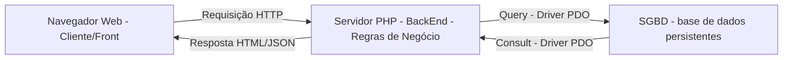
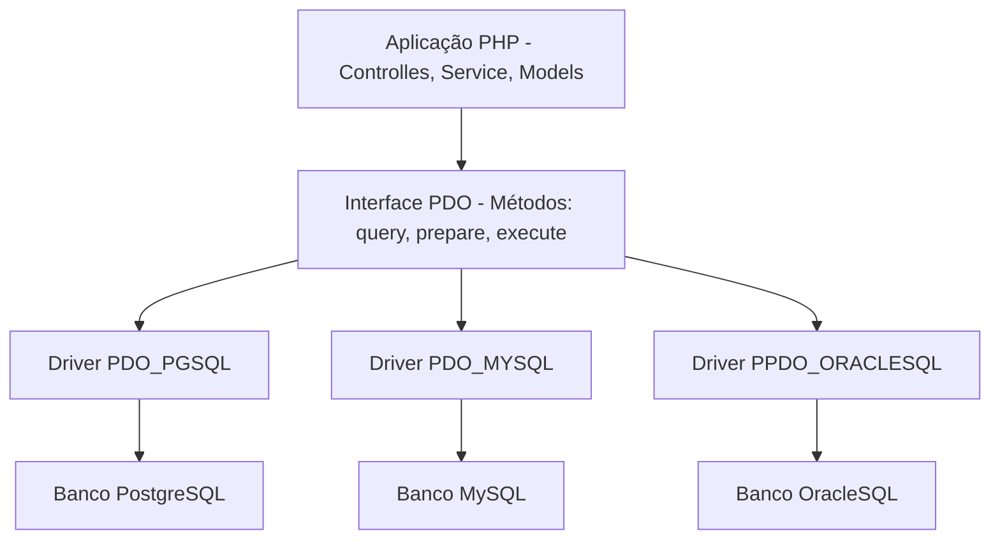

# Persistencai de dados com banco de dados relacionais (PostgreSQL) e Conexão PDO

**Tema:** 
- Camada de acesso a dados; 
- DriverPDO(PHP Data Objects); 
- Driver `pdo_pgsql`;
- Padrão singleton;
- Isolamento de Credenciais(`.env` `.ini`); 
- Tratamento de exceções(`PDOException`)


### **1. Da Memoria volartil ao banco de dados**

Em sistemas corporativos de grande porte, arquivos planos (`.txt` `.json`) não oferecem a segurança , integridade, concorrencia e velocidade necessária para armazenamentos de dados. Então é aqui que o **BackEnd** encontra o **Banco de Dados Relacional**.


Banco de dados Relacional Permite:
- Conectar a lógica de programação serve-side ao sistema de gerenciamento de banco de dados (SGBD).
- Garantindo persistÊncia definitiva e segura dos registros.
- Aplicando integridade referencial, constraints, consultas otimizadas e produtividade `ACID` aprendidas na diciplina de Banco de dados.

>ACID: Atomicidade: assegura que cada transação seja unica.

>Consistencia: respeita todas as regras, restrições e chaves definidas, garantindo a validade da transação

> Isolamento: transacões são realizadas de forma independente.

> Durabilidade: transações são confirmadas, garantindo persistencia permanente.


### **2. Oque é o PDO(PHP Data Object)?**

O **PDO** é uma camada de abstração de acesso a dados integrada nativamente ao PHP. Ele fornece uma interface uniforme e orientada a bojetos para se comunicar com múltiplos sistemas de banco de dados (PostgresSQL, MySQL, SQLite, OracleSQL, SQLServer).


### **3. Vantagens do uso do PDO**

- **Portabilidade de Código**: Os métodos de conexão, consulta e transções são identicos, independente do banco utilizado. Se o cliente migrar de banco Postgres para outrro SGBD(MySQL), o programador apenas altera a string DSN de conexão, preservando toda a logica de acesso já utilizada ou criada.

- **Suporte Nativo A Prepared Statement**: O PDO foi projetado para trabalhar com consultas nativas, oferecendo defesa contra ataques de **SQL_Injection**.

- **Tratamento Orientado a Objetos com Exception**: Em vez de retornar codigos de erros, o PDO laça uma instancia de classe especializada `PDOException`

## **A Sintaxe da conexão PDO: DSN(Data Source Name)**

Para que o PDO saiba onde o banco esta localizado, em qual porta abrir, utilziamos a string padronizada **DSN**.

```text
pgsql:host=127.0.0.1;port=5432;dbname=seu_banco
  |          |            |           |
  |          |            |           └─ Nome da base de dados ralacional(nome do banco)
  |          |            └─ Porta padrão do Banco de Dados PostgreSQL(5432)
  |          └─ Endereço IP ou hostname do servidor
  └─ Identificador do driver do SGBD(pgsql) - PostgreSQL
```

### **4. A configuração do PDO**
Ao instanciar um objeto PDO, devemos configurar quadro flags essenciais que determinam como o driver se comportara frente a erros e consultas ao SGD

```php
$opcoes = [
    //1. flag: Lança exceções imediatamente quando ocorrer qualquer erro SQL
    PDO::ATTR_ERRMODE => PDO::ERRMODE_EXCEPTION,

    //2. Retorna registros apenas com nomes das colunas (Eliminar duplicidade numérica)
    PDO::ATTR_DEFAULT_FETCH_MODE => PDO::FETCH_ASSOC,

    //3. Desatica emulação e utiliza prepared statements nativos 
    PDO:: ATTR_EMULATE_PREPARES => false,

    //4. Limita a 5 segundos para tentar a conexão com o servidor do BD
    PDO:: ATTR_TIMEOUT => 5
];
```

**Detalhamento das Flags**:

- PDO::ATTR_ERRMODE => PDO::ERRMODE_EXCEPTION : por padrão o PDO pode falhar silenciosamente e retorna apenas `false`. Ao Ativar o ERR_MODE força o PHP a dispara uma `PDOException`, permitindo que o nosso código interprete qualquer erro em um bloco `try-catch`.

- PDO::ATTR_DEFAULT_FETCH_MODE => PDO::FETCH_ASSOC : por padrão o métos `fetch()`retrona um array duplicado ontendo índices numéricos`[0,1]`e associativos`["id","código_maquina"]`. Definir `FETCH_ASSOC`reduz o consumo de memória RAM pela metade e entrega coleções limpas.

- PDO::ATTREMULATE_PREPARES => false : Garante que o PHP envie a consulta e os parêmtros separados diretamente para o planejador do BD processar, blindando e aplicação contra ataques sofisticados de `SQL_injection`

### **5. Proteção de Credenciais**

Um dos erros mais graves cometidos por desenvolvedores iniciantes é escrever dados de conexão diretamente dentro do codigo:

```php
//péssima prática de código
$pdo = new PDO("pgsql:host=localhost; dbname="producao"; "postgres"; "senha12345");
//observer que as credenciasi estão expostas nos código
```
Se esse arquivo for versionado e enviado para github:
1. Suas senhas de produção ficam publicas
2. Robos maliciosos varrem repositorios á procura de credenciais expostas, para invadir banco de dados e sequestrar informações(ataque de Ransoware)
3. A empresa é penalizada por violações da **LGPD(Lei Geral de Proteção de Dados)**

**A Abordagem Segura: Usando Arquivos de Configuração Isolada (`.ini` `.env`)**

Isolamos as credenciais em um arquivo externo protegido que **nunca entra no Git**

```ini
; config/database.ini
[database]
db_driver   = pgsql
db_host     = 127.0.0.1
db_port     = 5432
db_name     = producao
db_user     = postgres
db_pass     = senha12345
```
Adiconameos o Arquivo Isolado ao `.gitignore`

```text
config/database.ini
.env
logs/*.log
```

---

#### **6. Padrão Singleton de Conexão**

Imagian uma aplicação web com 500 usuários acessando simultaneamente. Se cada script, função ou método executar `new PDO()`, ou seja, abrir uma nova conexão, sempre que precisar consultar o banco de dados, teremos milhares de conexão de redes abertas desnecessariamente.

No SGBD(PostgresSQL), cada conexão aberta cria um processo no sistema operacional dedicado. Abrir conexões repetidas esgotam rapidamente o limite configuradp (`max_connection`) do BD gerando um erro:

`Fatal Error: sorry, too many clients already`

**Como o Singleton Resolve Isso**

O pdrão **Singleton** garante que **apenas uma única instancia de conexão PDO exista por requisição**, reutilizando a conexão existente em qualquer ponto do sistema. 

**As Configurações do Singleton**

1. **Construtores Privados** (`private function _constructor`): Impede que outros arquivos instanciem uma nova conexão

2. **Propriedade/Atributos Estáticas Privadas**: (`private static ?PDO $instancia = null`): Aramzena a Conexão aberta na Classe

3. **Métodos de acesso Estáticos Públicos**: (`public static function obterConexao():PDO`): A Conexão é criada pelo método, garantindo acesso a conexão, mas não acesso aos atributos da conexão, se caso já existir uma conexão, apenas devolve a conexão existente para o operador, sem a necessidade de crir uma nova.

4. **Bloqueio de Clonagem e Desserialização**: (`_clone` e `_wakeup`): Garantir que ninguém consiga duplicar o objeto da conexão.

### **7. Tratamento de Falhas com `PDOException`**

Quando uma tentativa de conexão falha(servidor desligado, senha incorreta, porta inacessível ...), o PDO lança uma Exceção (`PDOException`). Então, devemos tratar essa falhas. 

**Práticas recomendadas de segurança** (AppSec):

* **Para o Usuário**: Exibir mensagens amigáveis e genéricas: *Não é possível processar sua solicitação. Tente novamente mais tarde*
* **Para a Equipe de Desenvolvimento**: Gravar os detalhes técnicos da falha com timestamp(carimbo de data e hora) em um arquivo de log seguro (`log/database.log`);

---
