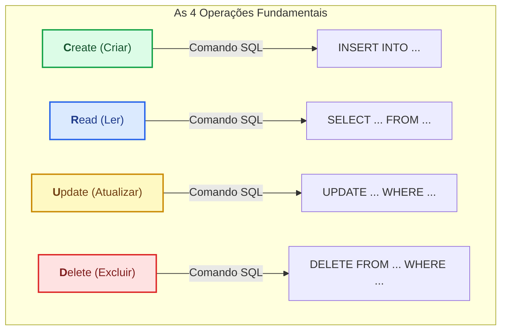
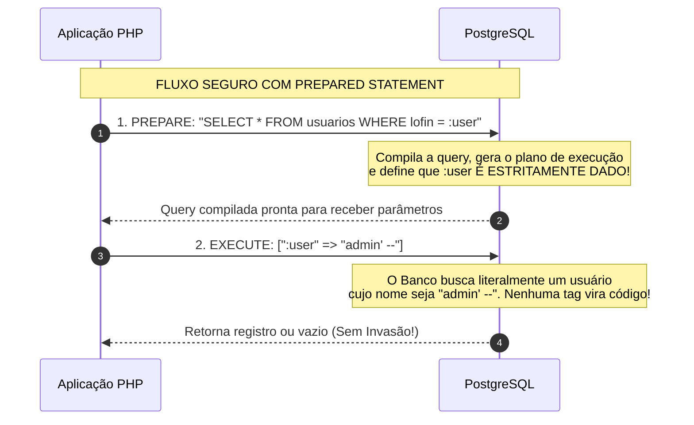
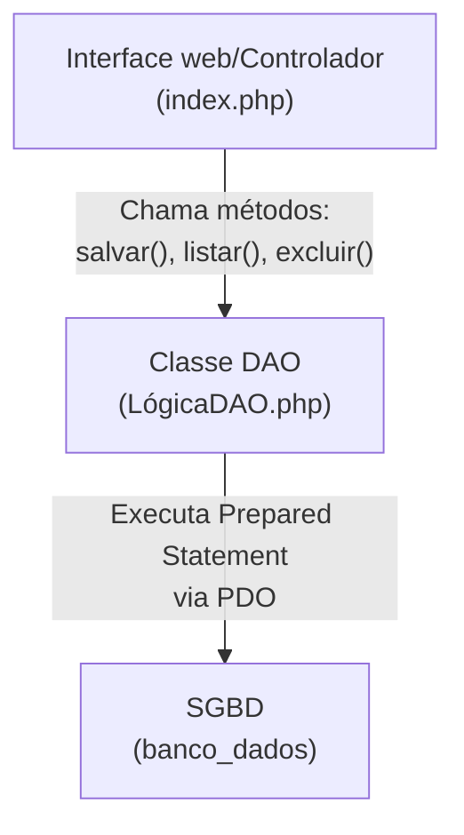

# CRUD completo com Prepared Statements e Proteção Contra SQL Injection

**tema:** Operações CRUD, Vulnerabilidade SQL Injection (OWASP Top 10), Consultas Preparadas com PDO (`prepare`, `bindValue`, `execute`), Marcadores Nomeados e Padrão de Arquitetura DAO (DAA ACCESS OBJECT)

Em qualquer organização , o objetivo central de um sistema de software é manipular informações com segurança, velocidade e consistência. Essa manipulação se resuma a quatro operações fundamentaios que todo desenvolvevdor BackEnd deve dominar com perfeição, essa operações são conhecidas pelo acronimo **CRUD**.




Na Semana 08 , aprendemos a como conectar usando a extensão PDO e utilizando o padrão Singleton. Agora, vamos dar vidar a essa conexão: Aprenderemos a inserir novos registros, consultar com filtros dinâmicos e remover e atulizar dados com segurança.

--- 

#### **A Maior Ameaça da História da Web: SQL Injection (`SQLi`)**

Antes de Escrevermos a primeira query de manipulação, precisamos compreender o perido que cerca o acesso a banco de dados.

A vulnerabilidade **SQL Injection** que ocupa o topo das listas mais críticas de cibersegurança. Ela Ocorre quando um desenvolvedor comete um erro gravíssimo de **concatenar entradas fornecidas pelo usuário diretamente na instrução SQL**

**Exemplo de Código Proibido (Concatenação de String)**

Imagina um sistema que valida o login de um operador da seguinte forma:

```php
//Codigo Vulnerável e Perigoso - NUNCA FAÇA ISSO!
$usuário = $_POST["usuário"];
$senha = $_POST["senha"];
//invasor digita no campo usuario: admin' -- 

$sql = "SELECT * FROM usuarios WHERE login = '".$usuario . "'AND senha= '".$senha . "'";
$resultado = $pdo->query($sql) 
```

**O qe acontece quando o atacante digita: `admin' --`?**

A strinf final importada pelo PHP envia seguinte mensagem para o banco 

```sql
SELECT * FROM usuarios WHERE login = 'admin' --' AND senha= '...'
```

1. A aspa digitada pelo atacante fecha a string do loguin antecipadamente
2. O operador `--` no banco de dados indica o **inicio de um comentario**
3. O restante do codigo da query (a validação de senha) é ignorado pelo morto de busca do banco
4. **resultado:** O invasor faz loguin instantanemente na conta do administrador sem precisar saber a senha.

**3 Cenários Mais utilizados de SQL Injection**

| Tipo de Injeção | Payload Injetado pelo Invasor | Consequência no PostgreSQL |
| :--- | :--- | :--- |
| **Bypass de Autenticação** | `' OR '1'='1` | A condição torna-se sempre verdadeira, retornando o primeiro usuário da tabela (geralmente o administrador do sistema). |
| **Exfiltração de Dados (UNION SQLi)** | `' UNION SELECT id, nome, senha FROM usuarios --` | O invasor anexa tabelas sigilosas inteiras no resultado da consulta visível na tela, violando a LGPD. |
| **Destruição / Adulteração (Stack Queries)** | `'; DROP TABLE pecas_industriais; --` | Dependendo do driver e das permissões do usuário, o invasor encerra a consulta atual e executa comandos de destruição em massa. |


## **A defesa definitiva: PREPARED STATEMENTS**

Usar consulta cok Prepared Statements evita que ocorra SQL Injection


**Por que a consulta preparada (`prepare`) é imune a injeções?**

Quando utilizamos `$pdo->prepare()`, ocorre uma **separação fisica e temporal** entre o *comando SQL** e os **dados do usuario**:
1. **Fase de compilação (`prepare`)**: O banco recebe o molde da instrução com marcadores (`:parametros`). Ele analisa a sintaxe, otimizada o caminho de busca e compila o plano de execução. A estrutura logica da consulta esta **fechada e congelada**
2. **Fase de envio dos Dados (`execute`)**: O PHP envia apenas os valores literais. Mesmo que o invasor envie aspas, ponto-e-virgula ou comandos `DROP`, o Banco Tratara tudo exclusivamente como um texto inofensivo pertence aquele campo.

---

## Marcadores Nomeados e posicionais no PDO

O PDO aceita dois formatos de marcadores em prepared statements

1. **Marcador Posicional (`?`):**

```php 
//Funcionam, mas é sujeito a erros de contagem de parâmetros em queries longas
$sql = "INSERT INTO usuarios (id, nome, email, telefone) VALUES (?, ?, ?, ?)";
$stmt = $pdo->prepare($sql);
$stmt->execute([$id, $nome, $email, $telefone]);
```
 

2. **Marcadores Nomeados (`:nome`) - Padrão Recomendado** 

```php
//autenticação autoexplicativa,
$sql = "INSERT INTO usuarios (id, nome, email, telefone) VALUE (:id, :nome, :email, :telefone)";
$stmt = $pdo->prepare($sql);
$stmt->execute([
    ":id"        => $id,
    ":nome"      => $nome,
    ":email"     => $email,
    ":telefone"  => $telefone
]);
```

## **Metodo de vinculação de valores: `bindValue()` Vs. `bindParam()`**

Ao associar parâmetros a uma consulta `prepare`, pode-se utilizar dois métodos com comportamentos distintos. o `bindValue()` ou o `bindParam()`, o primeiro vincula um valor fixo no momento da chamada, enquanto o segundo vincula uma variável por referência e só avalia o valor real quando a consultal é executada.

**Exemplo `bindValue()`**: Associa o valor exato da variavel naquele momento, é mais comum e seguro para 95% dos casos de so.
```php
$id = 10;
$stmt->bindValue(":id", $id, PDO::PARAM_INT);
$id = 20; // não altera o valor que ja foi passado no bindValue!
$stmt->execute(); //executa com id =10
```

**Exemplo `bindParam()`**: Associa a variável como uma referência de memória (`&`). O valor é lido no momento exato da chamada `execute`. Usar apenas em loops ou situações específicas que precisa alterar o valor repetidamente.
```php
$id = 10;
$stmt->bindParam(":id", $id, PDO::PARAM_INT);
$id = 20; //altera o valor de referência
$stmt->execute(); //executa com id = 20
```

>obs: Tipagem Explícita com Constantes do PDO:
>Para Garantir que o PostgreSQL interprete corretamente o tipo de dado, inform-se sempre a constante correspondente:
> * `PDO::PARAM_INT`: Para chaves primárias, quantidades e inteiros.
> * `PDO::PARAM_STR`: Para textos, strings, datas e números decimais (`NUMERIC`).
> * `PDO::PARAM_BOOL`: Para valores booleanos (`true`/`false`).
> * `PDO::PARAM_NULL`: Para passar valores nulos explícitos.

## O Padrão de Arquitetura DAO(DATA ACCESS OBJECT)

Em aplicações profissionais, comando SQL nunca devem ser escritos diretamente dentro de arquivos de interface visual ( como páginas HTML ou controladoras de tela)

Para separar a **lógica de apresentação** da **lógica de acesso a dados**, usa-se o padrão de projetos **DAO(DATA ACCESS OBJECT)**:


