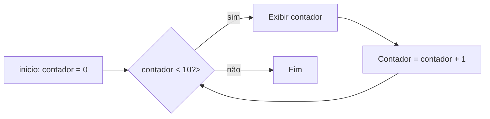
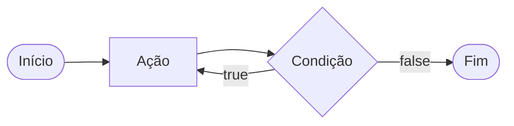
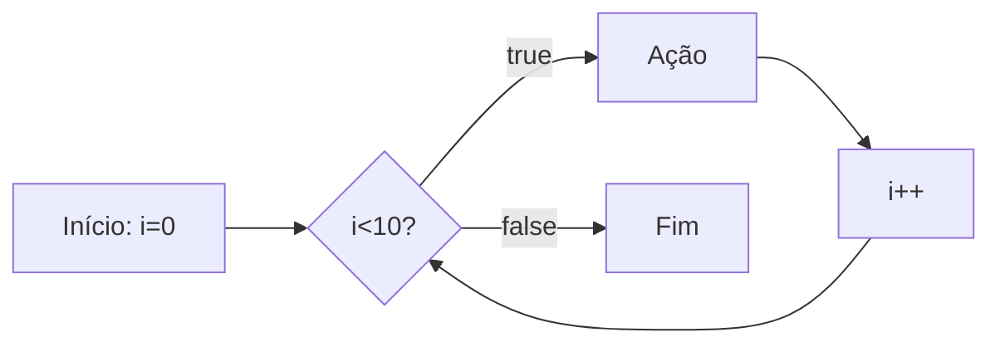

# laços de Repetição

Um laço de repetição faz com que um bloco de código rode várias vezes até que uma condição mande parar. 

- O Laço `while` (Enquanto)

Ele verifica se a condição é verdadeira `ANTES` de entrar no laço. Ideal quando vc  sabe exatamente quantas vezes vai rodar o laço.



Exemplo de Aplicação do while: Jogo de adivinhação de um nº secreto 

```php
$numSecreto = rand(1,10);

$tentativas = 0;

$numeroEscolhido = 0;

while ($numEscolhido != $numeroSereto){
    echo "Tente novamente"
    //vou escolher outro Nº para adivinhar
    $numeroEscolhido = rand(1,10;);
    $tentativas++;
}  

echo "acerto fe!!!!!!!! o creto é $numeroEscolhido";

```

- O Laço `do-while` (Faça - Enquanto)

A diferença é que ele executa o bloco pelo menos uma vez, mesmo que a conduição seja false desde o início, pois ele só pergunta no final.



Exemplo: Jogo de advinhação de um nº

```php

$numSecreto = rand(1,10);


do{
    $numeroEscolhido = rand(1,10);
    
    if($numeroEscolhido == $numeroSecreto){
        echo "Parabens, Acertou!!!!!!";
        break;    
    }
    echo "tente dnv pq tu erro!!!!";

} while($numEscolhido != $numSereto);

```
##### O Freio de Emergência: `break` e `continue`

As vezes precisamoso interferir no laço enquanto ele esta rodando
- `break`=> **Para tudo!** Quebra o laço todo e vai embora
- `continue` => **Pula a rodada** Ele ignora o codigo daquela rodada especifica e pula logo para a proxima repetição.

Exemlo: sistema de controle de elevador.

```php
for($andar = 1; $andar<=10; $andar++){
    if($andar ==4){
        echo "andar $andar esta em obras. Passando direto!";
        continue;
    
    }
    echo "elevador parou no andar $andar"
}
```
--- 

### Laço de repetição `for`
Use `for`quando vc sabe quantas vezes precisa repetir uma ação ou quando precisa controlarum contador. Ele possui tres partes:
- inicialização,
- condição
- incremento

for(inicialização; condição; incremento){}



Exemplo: exibir todos os meses do Ano

```php
for($mes=1; $mes<=12; $mes++){
    echo "mes: $mes";
}
```

Nesse exemplo, `$mes` comeca em 1, o laco ontinua enquanto `$mes` for menor ou igual  a 12 e, ao final de cada repeticao, `$mes++` aumenta o contador em 1.

###### Foreach

Use o `foreach` quando precisar percorre cada item de um **array**. Ele acessa os elementos diretamente, se que vc precise controlar o contador.

```php
$frutas = ["maca", "banana", "uva", "pera"];

foreach($frutas as $fruta){
    echo "fruta: $fruta";
}
```

Outro Exemplo: Acessar a chave e o valor de cada item:

```php
$precos = [
    "caderno" => 25.90,
    "caneta" => 5.50,
    "mochila" => 99.00
];//vetor n ordenado chave => valor

foreach ($precos as $produto => $preco) {
    echo "$produto:". R$ number_format($preco,2);
}

```